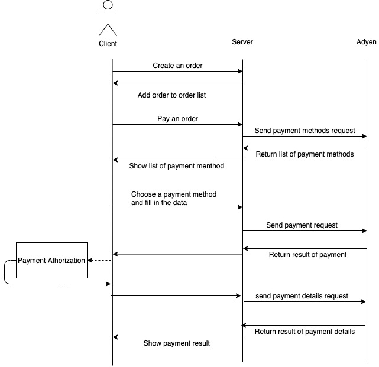

# Adyen checkout challenge
# Introduction
The project is implemented with Blazor. Blazor is a free and open-source web framework that developers can create web applications using C#, HTML and CSS instead of JavaScript. The client and server code are both written in C#.

# Supported Integration
Adyen Web Drop-in

# Requirement
.Net Core SDK 5

# How to run the application
*	Clone this repo in your command prompt:
Git clone https://github.com/yidiwu1/AdyenCheckoutChallenge.git
*	To call Adyen, you need to set up user secrets. 
Go to WebPayment/Server and run command: dotnet user-secrets set "ApiKey" "AQEyhmfxLI3MaBFLw0m/n3Q5qf3VaY9UCJ14XWZE03G/k2NFitRvbe4N1XqH1eHaH2AksaEQwV1bDb7kfNy1WIxIIkxgBw==-y3qzswmlmALhxaVPNjYf74bqPotG12HroatrKA066yE=-W+t7NF;s4}%=kUSD"
To check if you set user secret successfully, you can run command: dotnet user-secrets list
*	Start the server you should run command under WebPayment/Server:
dotnet watch run
*	Then you should be able to visit http://localhost:5000/

# Checkout flow diagram

# Why choose Blazor
When I heard about Blazor, I think it is a cool and quite new web framework. Learning and using a new technology is a challenge for me, and I am proud of the achievement on the assessment test. Also, Blazor WebAssembly is more likely to enhance JavaScript in the near future.
Which part can be improved
Due to time limits, error handling, extensive unit tests and integration tests are not implemented. It would be nice to have them, but for now we see this project as a POC.

# What challenges are met
*	Learned new web framework Blazor.
*	Went through Adyen Web Drop-in integration documentation and understood how it works. 
*	To integrate npm packages into Blazor
*	Without using Adyen NuGet packages, it was a challenge to get the right models.
